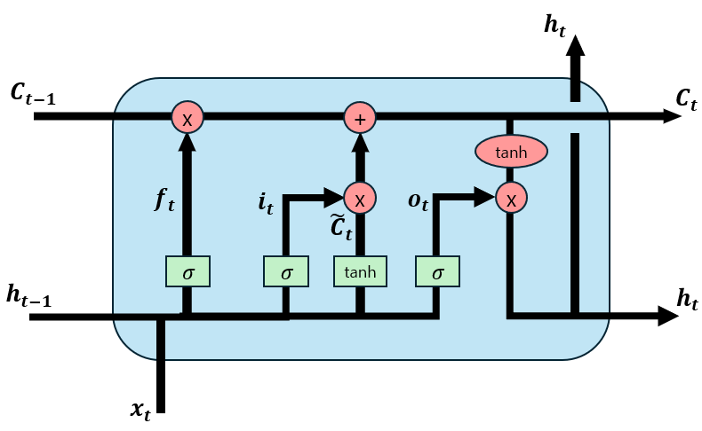
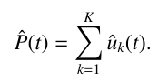
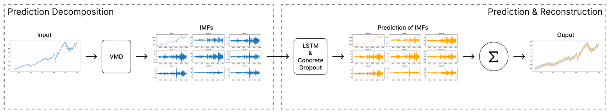
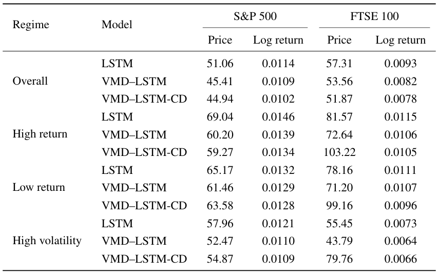

# VMD-LSTM Stock Forecast with Concrete Dropout

This project implements a financial time-series forecasting framework based on **Variational Mode Decomposition (VMD)** and **LSTM with Concrete Dropout** for uncertainty-aware prediction.

The model decomposes nonstationary financial signals into frequency-specific components and learns temporal patterns using LSTM networks. Concrete Dropout enables the model to estimate epistemic uncertainty through stochastic forward passes.

This work is based on the research paper:

**Dual-Uncertainty Modeling in Financial Time-Series via VMD-LSTM with Concrete Dropout and VMD-WGAN**

---

# Overview

Financial time-series forecasting should not only produce accurate predictions but also quantify uncertainty around future outcomes.

This project proposes a framework that separates two types of uncertainty:

- **Epistemic uncertainty** (model uncertainty)
- **Aleatoric uncertainty** (market uncertainty)

The predictive path focuses on forecasting stock prices and estimating model uncertainty using **VMD-LSTM-CD**.

The approach was evaluated on the **S&P 500** and **FTSE 100** indices.

---

# Method

The proposed pipeline consists of three main stages.

## 1. Variational Mode Decomposition (VMD)

Financial time series are highly nonstationary and contain multiple frequency components.

VMD decomposes the original signal into a set of intrinsic mode functions (IMFs), each representing a frequency-specific component.

Benefits:

- reduces cross-frequency interference  
- stabilizes learning for neural networks  
- improves signal-to-noise ratio  

---

## 2. VMD-LSTM Prediction Model

Each IMF is modeled using an independent LSTM network.

Input:

historical window of length N

Prediction:

one-step-ahead forecast

The final stock price prediction is obtained by summing forecasts across all IMFs.

---

## 3. Concrete Dropout for Uncertainty Estimation

Concrete Dropout enables the model to learn dropout probabilities during training.

During inference:

- multiple stochastic forward passes are performed
- prediction variance represents **epistemic uncertainty**

This produces **prediction intervals** around the forecast.

---

# Model Architecture

Framework:

---

# Dataset

Historical daily stock price data:

- **S&P 500**
- **FTSE 100**

Source:

Yahoo Finance

Data split:

Train: 2013–2023
Test: 2024

---

# Results

The proposed model was compared with:

- LSTM
- VMD-LSTM
- VMD-LSTM-CD (proposed)

Evaluation metric:

RMSE

The proposed model achieved the lowest prediction error and more stable forecasts across different market regimes.

---

# Reference

Huh, J., Kim, D., Jung, M., & Jeong, S.  
Dual-Uncertainty Modeling in Financial Time-Series via VMD-LSTM with Concrete Dropout and VMD-WGAN.  
Networks and Heterogeneous Media, 2025.
